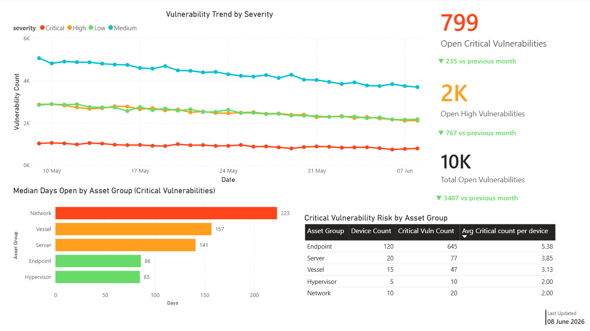
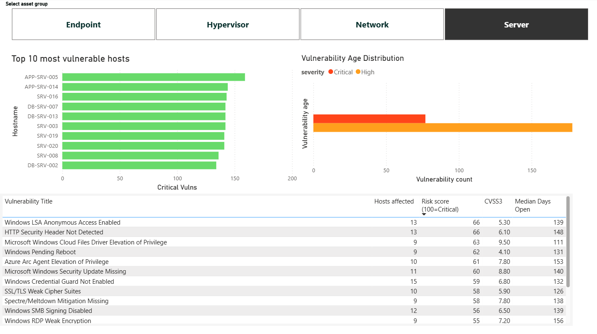

# qualys-etl-powerbi

Automated vulnerability reporting pipeline — pulls data from the Qualys API, transforms it into clean datasets, and feeds Power BI dashboards for management and security team reporting.

## Dashboards

### Executive Summary

*Screenshots use anonymised mock data for portfolio purposes.*

Management-facing overview of security posture across the full asset estate. Shows vulnerability trends by severity, open Critical and High counts with month-on-month comparison, median days open by asset group, and critical risk ranked by fleet.

### Drill Down

*Screenshots use anonymised mock data for portfolio purposes.*

Security team view. Asset group slicer filters all visuals simultaneously. Shows top 10 most vulnerable hosts, vulnerability age distribution, and top vulnerabilities ranked by Qualys Detection Score (QDS).

## Overview

A daily ETL pipeline running on a Proxmox LXC container that:

1. Fetches Qualys API credentials from Azure Key Vault at runtime
2. Authenticates with the Qualys API
3. Pulls VM detection data across the full asset estate
4. Classifies assets into six groups
5. Enriches detections with vulnerability titles, CVSS scores and CVE references
6. Writes clean CSV datasets with rolling retention
7. Uploads to Azure Blob Storage for Power BI consumption

## Architecture

```
[Proxmox LXC Container]
        ↓
[qualys_etl.py — daily cron @ 06:00]
[qualys_kb.py  — weekly cron @ 07:00 Sunday]
[qualys_scan_health.py — weekly cron @ 07:00 Monday]
        ↓
[Azure Key Vault — credentials fetched at runtime]
        ↓
[output/ — detections.csv, hosts.csv, summary.csv, kb.csv]
        ↓
[Azure Blob Storage — vulnerability-data container]
        ↓
[Power BI Service — auto-refreshes daily at 07:00]
```

## Asset Classification

| Group | Classification logic |
|---|---|
| Vessel | NETBIOS hostname contains vessel keywords (MASTER, BRIDGE, CHENG, CHIEFENG, etc.) |
| Hypervisor | OS string contains VMware ESXi, Hyper-V |
| Network | OS string contains Cisco, Fortinet, Juniper, etc. |
| Server | OS string contains Server, Linux, Ubuntu, Windows 20xx, etc. |
| Endpoint | OS string contains Windows 10/11, macOS |
| Unclassified | No match — reviewed periodically |

Vessel classification runs first and takes priority over OS-based checks.

## Output Datasets

| File | Description | Retention |
|---|---|---|
| `detections.csv` | One row per detection per day | 180 days |
| `hosts.csv` | One row per host per day | 180 days |
| `summary.csv` | Aggregated by asset group + severity per day | 3 years |
| `kb.csv` | QID lookup — titles, CVSS, CVE IDs | Overwrite weekly |

## Dashboard Pages

- **Executive Summary** — management-facing, trend lines by severity, month-on-month KPI cards, median days open by asset group, critical risk ranked by fleet
- **Drill Down** — security team view, asset group slicer, top vulnerable hosts, vulnerability age distribution, top QIDs by QDS risk score
- **Host Detail** — per-host vulnerability drillthrough (Power BI Pro)

## Scripts

| Script | Purpose | Schedule |
|---|---|---|
| `qualys_etl.py` | Main ETL — pulls all VM detection data | Daily 06:00 |
| `qualys_kb.py` | KnowledgeBase enrichment — titles, CVSS, CVEs | Weekly Sunday 07:00 |
| `qualys_scan_health.py` | Auth scan health check — Teams webhook alert | Weekly Monday 07:00 |

## Project Structure

```
/app/qualys/
├── src/
│   ├── qualys_etl.py           # Main ETL
│   ├── qualys_kb.py            # KnowledgeBase enrichment
│   └── qualys_scan_health.py   # Scan health monitor
├── output/                     # Generated CSVs (not versioned)
├── logs/                       # Daily logs, 30-day retention
├── .env                        # Azure identity only (not versioned)
├── run_etl.sh                  # Daily cron wrapper
├── run_kb.sh                   # Weekly cron wrapper
└── run_scan_health.sh          # Weekly cron wrapper
```

## Setup

### Prerequisites

- Python 3.x
- Qualys subscription with API access
- Azure Storage Account with Blob container
- Azure Key Vault with Qualys credentials stored as secrets
- Azure App Registration with Storage Blob Data Contributor and Key Vault Secrets User roles
- Power BI Pro licence for dashboard publishing and sharing

### Installation

```bash
pip3 install requests azure-storage-blob azure-identity azure-keyvault-secrets --break-system-packages

mkdir -p /app/qualys/{src,output,logs}
useradd -r -s /usr/sbin/nologin qualys
chown -R qualys:qualys /app/qualys
```

### Configuration

Create `/app/qualys/.env`:

```bash
export QUALYS_BASE_URL=qualys_api_url
export AZURE_TENANT_ID=your_tenant_id
export AZURE_CLIENT_ID=your_client_id
export AZURE_CLIENT_SECRET='your_client_secret'
export AZURE_STORAGE_ACCOUNT=your_storage_account_name
export AZURE_CONTAINER_NAME=vulnerability-data
export AZURE_KEYVAULT_URL=https://your-keyvault-name.vault.azure.net
export TEAMS_WEBHOOK_URL=your_teams_webhook_url
```

```bash
chmod 600 /app/qualys/.env
chown qualys:qualys /app/qualys/.env
```

### Key Vault Secrets

| Secret name | Value |
|---|---|
| `qualys-api-username` | Qualys API username |
| `qualys-api-password` | Qualys API password |

### Cron Schedule

```bash
0 6 * * * /app/qualys/run_etl.sh
0 7 * * 0 /app/qualys/run_kb.sh
0 7 * * 1 /app/qualys/run_scan_health.sh
```

### Manual Run

```bash
su -s /bin/bash qualys -c "source /app/qualys/.env && python3 /app/qualys/src/qualys_etl.py"
```

## Security Notes

- Qualys credentials stored in Azure Key Vault — never on disk
- Service runs as a dedicated non-login system user (`qualys`)
- `.env` is `chmod 600`, owned by `qualys` service user
- Minimum required Azure permissions (Storage Blob Data Contributor, Key Vault Secrets User)
- Blob container is private — no anonymous access
- `.env` excluded from version control

## Status

| Component | Status |
|---|---|
| ETL pipeline | ✅ Complete |
| Asset classification | ✅ Complete |
| KnowledgeBase enrichment | ✅ Complete |
| Azure Key Vault + Blob Storage | ✅ Complete |
| Cron automation | ✅ Complete |
| Scan health monitoring | ✅ Complete |
| Power BI dashboards | ✅ Complete |
| Power BI Service publishing | ✅ Complete |
